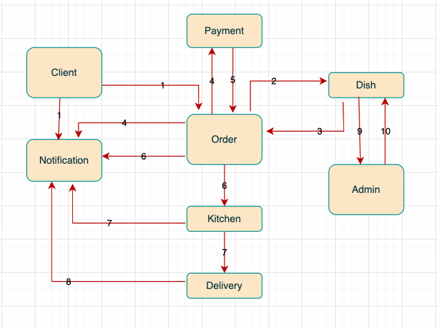

# **Микросервисное приложение - Сервис по доставке еды**

## Welcome!

_Микросервисное приложение по доставке еды
       
## Используемые технологии:

* Java 17

* Spring Boot (v2.7.7)

* Apache Tomcat/9.0.65

* Maven 4.0.0

* JDBC

* Hibernate ORM core version 5.6.11.Final

* Liquibase 

* PostgresSQL

* Lombok

## Требования к окружению

Maven 3.8.1

OpenJDK 17.0.1

Postgresql 14 

## Схема работы:



## Описание:
Для проекта предусмотрена одна единая база данных.
В ней таблицы:
Orders
Dishes
Notification
Будут так же добавлены Client и пр. по мере необходимости

Модули общаются между собой через Kafka

1й Независимый процесс

1 Заказ создаётся в Client и уходит в Order. Из Client в Notification уходит статус заказа «создан»

2 Order узнаёт у Dish наличие блюд

3 Dish отвечает Order'у -- блюда есть

4 Order меняет статус заказа на "ждёт оплату" (и отсылает инф в Notification) и отсылает в Payment.

5 Payment сообщает в Order, что заказ оплачен

6 Order пересылает это в Kitchen, чтобы начали готовить. Order пишет в Notification статус «начали готовить»

7 Заказ готов, Kitchen передаёт его в Delivery. Статус заказа об этом уходит в Notification

8 Delivery отправляет в Notification сообщение «доставлено»

2й  Независимый процесс

9 Если в Dish заканчиваются блюда, он уведомляет об этом Admin

Админ пополняет запасы или создаёт новые.

## Запуск приложения

### 1. Создать бд - наберите в консоли:

```
create database ;
```

### 2. Запуск приложения с maven. 
Перейдите в корень проекта через командную строку и выполните команды:

```
mvn clean install
```

```
mvn spring-boot:run
```


## Have a good job!
