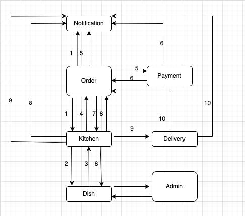

# **Микросервисное приложение - Сервис по доставке еды**

## Welcome!

_Благодаря этой программе Макдональдс не выдержит конкуренции и закроется!_
       
## Используемые технологии:

* Java 18

* Spring Boot (v2.7.3)

* Apache Tomcat/9.0.65

* Maven 4.0.0

* JDBC

* Hibernate ORM core version 5.6.11.Final

* Liquibase 

* PostgresSQL

* Lombok

## Требования к окружению

Maven 3.8.1

OpenJDK 17.0.1

Postgresql 14 

## Схема работы:



Maven 3.8.1

## Описание:

1й Независимый процесс

1 Заказ после создания отправляется на кухню и одновременно улетает к Notification статус заказа «создан»

2 Кухня отсылает с Dish проверку наличия блюд

3 Ответ блюда есть

4 Кухня пересылает ответ в Order.

5 Order пишет в Notification и в Payment статус заказа «Ждёт оплату»

6 Payment пишет в Notification и в Order «Заказ оплачен»

7 Order пересылает это в Kitchen, чтобы начали готовить

8 Kitchen отвечает, что статус «начали готовить», отсылает это в Notification и в Order. И убавляет у Dish количество блюд

9 Заказ готов, Kitchen передаёт его в Delivery. Статус заказа об этом уходит в Notification и в Order «заказ доставляется»

10 Delivery отправляет в Notification и в Order сообщение «доставлено»

2й  Независимый процесс

Одна из функций Admin – пополнение продуктов(пока пусть будет блюд) на складе. Админ создаёт у себя продукты, получает информацию об их наличии от Dish,  и пополняет запасы или создаёт новые.

## Запуск приложения

### 1. Создать бд - наберите в консоли:

```
create database ;
```

### 2. Запуск приложения с maven. 
Перейдите в корень проекта через командную строку и выполните команды:

```
mvn clean install
```

```
mvn spring-boot:run
```


## Have a good job!
